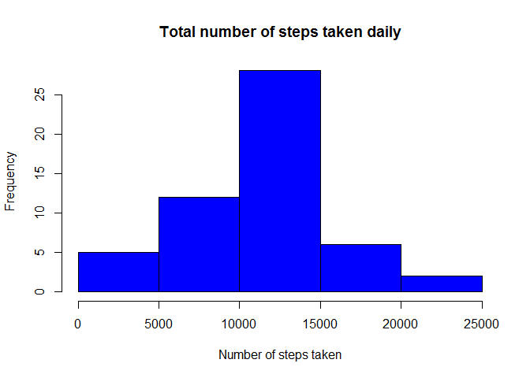
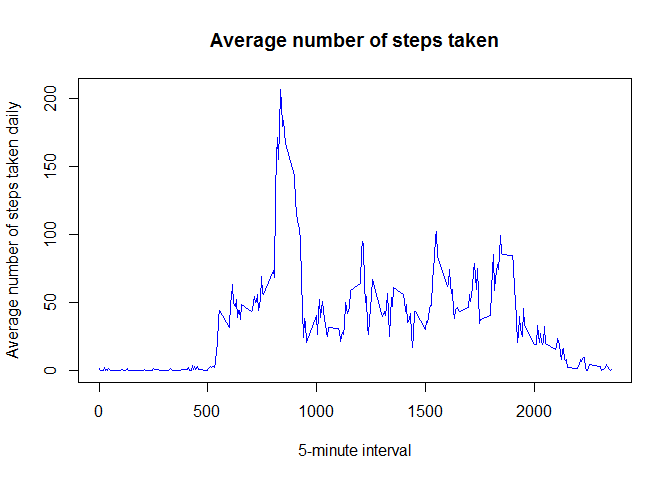
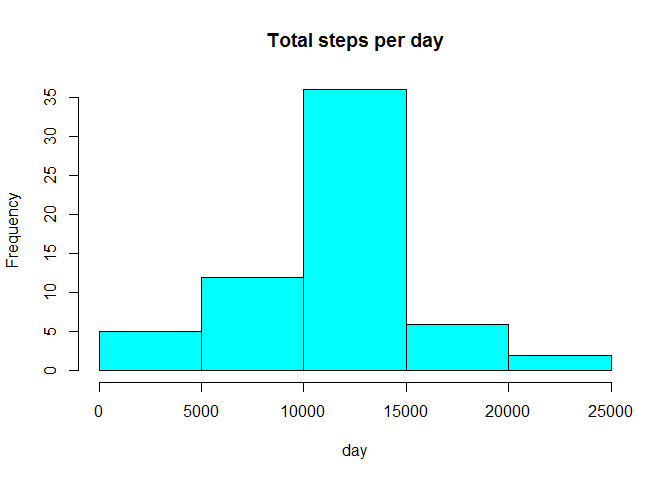
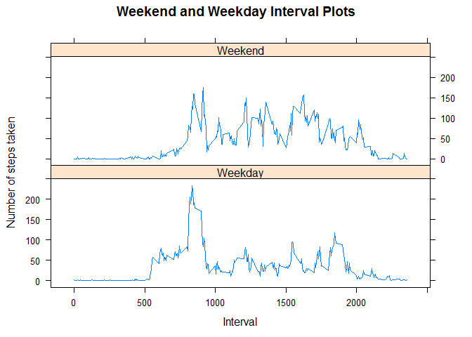

# Reproducible Research Assignment 1
Lee, Wei Yip  
September 20, 2015  

##Introduction
This assignment makes use of data from a personal activity monitoring device. This device collects data at 5 minute intervals through out the day. The data consists of two months of data from an anonymous individual collected during the months of October and November, 2012 and include the number of steps taken in 5 minute intervals each day.

##Data
The data for this assignment can be downloaded from the course web site:
- Dataset: activity monitoring data [52K]  

The variables included in this dataset are:  
- **steps**: Number of steps taking in a 5-minute interval (missing values are coded as NA)  
- **date**: The date on which the measurement was taken in YYYY-MM-DD format  
- **interval**: Identifier for the 5-minute interval in which measurement was taken  

The dataset is stored in a comma-separated-value (CSV) file and there are a total of 17,568 observations in this dataset. 

##Load libraries

```r
library(lattice)
```

##Loading and preprocessing the data
Load the data (i.e. read.csv()).  
Process/transform the data (if necessary) into a format suitable for your analysis.  


```r
activity <- read.csv("activity.csv", colClasses = c("numeric", "character", 
    "numeric"))
head(activity)
```

```
##   steps       date interval
## 1    NA 2012-10-01        0
## 2    NA 2012-10-01        5
## 3    NA 2012-10-01       10
## 4    NA 2012-10-01       15
## 5    NA 2012-10-01       20
## 6    NA 2012-10-01       25
```

```r
activity$date <- as.Date(activity$date, "%Y-%m-%d")
```

##What is mean total number of steps taken per day?
Calculate the total number of steps taken per day.


```r
totalSteps <- aggregate(steps ~ date, data = activity, sum, na.rm = TRUE)
```

Total number of steps taken per day (this omits days where 0 steps is taken):

```r
totalSteps
```

```
##          date steps
## 1  2012-10-02   126
## 2  2012-10-03 11352
## 3  2012-10-04 12116
## 4  2012-10-05 13294
## 5  2012-10-06 15420
## 6  2012-10-07 11015
## 7  2012-10-09 12811
## 8  2012-10-10  9900
## 9  2012-10-11 10304
## 10 2012-10-12 17382
## 11 2012-10-13 12426
## 12 2012-10-14 15098
## 13 2012-10-15 10139
## 14 2012-10-16 15084
## 15 2012-10-17 13452
## 16 2012-10-18 10056
## 17 2012-10-19 11829
## 18 2012-10-20 10395
## 19 2012-10-21  8821
## 20 2012-10-22 13460
## 21 2012-10-23  8918
## 22 2012-10-24  8355
## 23 2012-10-25  2492
## 24 2012-10-26  6778
## 25 2012-10-27 10119
## 26 2012-10-28 11458
## 27 2012-10-29  5018
## 28 2012-10-30  9819
## 29 2012-10-31 15414
## 30 2012-11-02 10600
## 31 2012-11-03 10571
## 32 2012-11-05 10439
## 33 2012-11-06  8334
## 34 2012-11-07 12883
## 35 2012-11-08  3219
## 36 2012-11-11 12608
## 37 2012-11-12 10765
## 38 2012-11-13  7336
## 39 2012-11-15    41
## 40 2012-11-16  5441
## 41 2012-11-17 14339
## 42 2012-11-18 15110
## 43 2012-11-19  8841
## 44 2012-11-20  4472
## 45 2012-11-21 12787
## 46 2012-11-22 20427
## 47 2012-11-23 21194
## 48 2012-11-24 14478
## 49 2012-11-25 11834
## 50 2012-11-26 11162
## 51 2012-11-27 13646
## 52 2012-11-28 10183
## 53 2012-11-29  7047
```

Make a histogram of the total number of steps taken each day.


```r
hist(totalSteps$steps, 
     main = "Total number of steps taken daily", 
     xlab = "Number of steps taken", 
     col = "blue")
```

 

Calculate and report the mean and median of the total number of steps taken per day


```r
mean(totalSteps$steps)
```

```
## [1] 10766.19
```

```r
median(totalSteps$steps)
```

```
## [1] 10765
```

The mean of steps taken is 10766.19.
The median of steps taken is 10765.

##What is the average daily activity pattern?
Make a time series plot (i.e. type = "l") of the 5-minute interval (x-axis) and the average number of steps taken, averaged across all days (y-axis).


```r
time_series <- tapply(activity$steps, activity$interval, mean, na.rm = TRUE)

plot(row.names(time_series), 
     time_series, 
     type = "l", 
     xlab = "5-minute interval", 
     ylab = "Average number of steps taken daily", 
     main = "Average number of steps taken", 
     col = "blue")
```

 

Which 5-minute interval, on average across all the days in the dataset, contains the maximum number of steps?


```r
max_interval <- which.max(time_series)
names(max_interval)
```

```
## [1] "835"
```

***The 835 interval contains the maximum number of steps taken on average.***

##Imputing missing values
Note that there are a number of days/intervals where there are missing values (coded as NA). The presence of missing days may introduce bias into some calculations or summaries of the data.  

Calculate and report the total number of missing values in the dataset (i.e. the total number of rows with NAs).  


```r
activityNA <- sum(is.na(activity))
activityNA
```

```
## [1] 2304
```

***The total number of missing values in the dataset is 2304.***  

Devise a strategy for filling in all of the missing values in the dataset. The strategy does not need to be sophisticated. For example, you could use the mean/median for that day, or the mean for that 5-minute interval, etc.   


```r
avgSteps <- aggregate(steps ~ interval, data = activity, FUN = mean)
fillNA <- numeric()
for (i in 1:nrow(activity)) {
    obs <- activity[i, ]
    if (is.na(obs$steps)) {
        steps <- subset(avgSteps, interval == obs$interval)$steps
    } else {
        steps <- obs$steps
    }
    fillNA <- c(fillNA, steps)
}
```

Create a new dataset that is equal to the original dataset but with the missing data filled in.  


```r
activityNew <- activity
activityNew$steps <- fillNA
```

Make a histogram of the total number of steps taken each day and Calculate and report the mean and median total number of steps taken per day.  


```r
totalSteps2 <- aggregate(steps ~ date, data = activityNew, sum, na.rm = TRUE)
```

The new histogram:

```r
hist(totalSteps2$steps, 
     main = "Total steps per day", 
     xlab = "day", 
     col = "cyan")
```

 

New mean and median:

```r
mean(totalSteps2$steps)
```

```
## [1] 10766.19
```

```r
median(totalSteps2$steps)
```

```
## [1] 10766.19
```

The new mean of steps taken is 10766.19.
The new median of steps taken is 10766.19.

Do these values differ from the estimates from the first part of the assignment? What is the impact of imputing missing data on the estimates of the total daily number of steps?  
***Yes, the median value is different from the first part of the assignment. The median of steps taken is 10765 when the missing data was not filled in with the mean number of steps taken.***  

##Are there differences in activity patterns between weekdays and weekends?

For this part the weekdays() function may be of some help here. Use the dataset with the filled-in missing values for this part.  

Create a new factor variable in the dataset with two levels - "weekday" and "weekend" indicating whether a given date is a weekday or weekend day.  


```r
day <- weekdays(activity$date)
dayInterval <- vector()
for (i in 1:nrow(activity)) {
    if (day[i] == "Saturday") {
        dayInterval[i] <- "Weekend"
    } else if (day[i] == "Sunday") {
        dayInterval[i] <- "Weekend"
    } else {
        dayInterval[i] <- "Weekday"
    }
}
activity$dayInterval <- dayInterval
activity$dayInterval <- factor(activity$dayInterval)

stepsByDay <- aggregate(steps ~ interval + dayInterval, data = activity, mean)
names(stepsByDay) <- c("interval", "dayInterval", "steps")
```


Make a panel plot containing a time series plot (i.e. type = "l") of the 5-minute interval (x-axis) and the average number of steps taken, averaged across all weekday days or weekend days (y-axis). See the README file in the GitHub repository to see an example of what this plot should look like using simulated data.  


```r
xyplot(steps ~ interval | dayInterval, 
       stepsByDay, 
       type = "l", 
       layout = c(1, 2),
       main = "Weekend and Weekday Interval Plots",
       xlab = "Interval", 
       ylab = "Number of steps taken")
```

 


