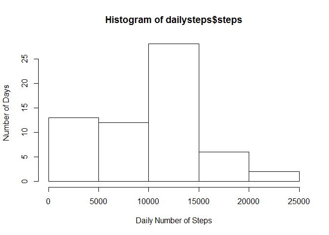

# Reproducible Research Assignment 1
Lee, Wei Yip  
September 20, 2015  

##Introduction
This assignment makes use of data from a personal activity monitoring device. This device collects data at 5 minute intervals through out the day. The data consists of two months of data from an anonymous individual collected during the months of October and November, 2012 and include the number of steps taken in 5 minute intervals each day.

##Data
The data for this assignment can be downloaded from the course web site:
- Dataset: Activity monitoring data [52K]  

The variables included in this dataset are:
- **steps**: Number of steps taking in a 5-minute interval (missing values are coded as NA)
- **date**: The date on which the measurement was taken in YYYY-MM-DD format
- **interval**: Identifier for the 5-minute interval in which measurement was taken

The dataset is stored in a comma-separated-value (CSV) file and there are a total of 17,568 observations in this dataset. 

##Load libraries

```r
library(plyr)
```

```
## Warning: package 'plyr' was built under R version 3.2.2
```

```r
library(ggplot2)
```

```
## Warning: package 'ggplot2' was built under R version 3.2.2
```

##Loading and preprocessing the data
The .zip file is downloaded and de-compressed beforehand. 
Read in the data. 
Set the dates to POSIXct


```r
activity <- read.csv("activity.csv")
activity$date <- as.POSIXct(strptime(activity$date, format = "%Y-%m-%d"))
```

##What is mean total number of steps taken per day?
Calculate the total number of steps taken per day.


```r
dailysteps <- aggregate(activity$steps, by = list(activity$date), sum, na.rm=TRUE) 
names(dailysteps) <- c("Date", "steps")
dailysteps
```

```
##          Date steps
## 1  2012-10-01     0
## 2  2012-10-02   126
## 3  2012-10-03 11352
## 4  2012-10-04 12116
## 5  2012-10-05 13294
## 6  2012-10-06 15420
## 7  2012-10-07 11015
## 8  2012-10-08     0
## 9  2012-10-09 12811
## 10 2012-10-10  9900
## 11 2012-10-11 10304
## 12 2012-10-12 17382
## 13 2012-10-13 12426
## 14 2012-10-14 15098
## 15 2012-10-15 10139
## 16 2012-10-16 15084
## 17 2012-10-17 13452
## 18 2012-10-18 10056
## 19 2012-10-19 11829
## 20 2012-10-20 10395
## 21 2012-10-21  8821
## 22 2012-10-22 13460
## 23 2012-10-23  8918
## 24 2012-10-24  8355
## 25 2012-10-25  2492
## 26 2012-10-26  6778
## 27 2012-10-27 10119
## 28 2012-10-28 11458
## 29 2012-10-29  5018
## 30 2012-10-30  9819
## 31 2012-10-31 15414
## 32 2012-11-01     0
## 33 2012-11-02 10600
## 34 2012-11-03 10571
## 35 2012-11-04     0
## 36 2012-11-05 10439
## 37 2012-11-06  8334
## 38 2012-11-07 12883
## 39 2012-11-08  3219
## 40 2012-11-09     0
## 41 2012-11-10     0
## 42 2012-11-11 12608
## 43 2012-11-12 10765
## 44 2012-11-13  7336
## 45 2012-11-14     0
## 46 2012-11-15    41
## 47 2012-11-16  5441
## 48 2012-11-17 14339
## 49 2012-11-18 15110
## 50 2012-11-19  8841
## 51 2012-11-20  4472
## 52 2012-11-21 12787
## 53 2012-11-22 20427
## 54 2012-11-23 21194
## 55 2012-11-24 14478
## 56 2012-11-25 11834
## 57 2012-11-26 11162
## 58 2012-11-27 13646
## 59 2012-11-28 10183
## 60 2012-11-29  7047
## 61 2012-11-30     0
```

Make a histogram of the total number of steps taken each day.


```r
hist(dailysteps$steps, 
      xlab = "Daily Number of Steps",
      ylab = "Number of Days")
```

 

Calculate and report the mean and median of the total number of steps taken per day


```r
mean.steps <- mean(dailysteps$steps) 
median.steps <- median(dailysteps$steps)
```

The mean number of steps each day is 9354.
The median number of steps each day is 10395.

##What is the average daily activity pattern?
Make a time series plot (i.e. type = "l") of the 5-minute interval (x-axis) and the average number of steps taken, averaged across all days (y-axis).

Which 5-minute interval, on average across all the days in the dataset, contains the maximum number of steps?


```r
#df of the mean and median number of steps taken, averaged across all days (y-axis)
intsteps <- aggregate(activity$steps, by = list(activity$interval), mean, na.rm=TRUE)
intstepsmed <- aggregate(activity$steps, by = list(activity$interval), median, na.rm=TRUE)

intsteps <- cbind(intsteps[], intstepsmed$x)

#Tidy the df names and round the numbers
names(intsteps) = c("interval","mean.steps", "median.steps")
intsteps$mean.steps <- round(intsteps$mean.steps)
intsteps$median.steps <- round(intsteps$median.steps)


ggplot(intsteps, aes(x = interval, y = mean.steps)) + geom_line()
```

 


